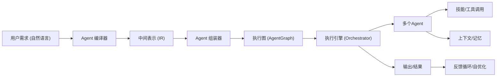

# 执行摘要  
本报告针对“自动化定制多Agent平台”提出系统性架构方案，将用户的自然语言需求编译为可执行的多智能体系统（Agent System）。核心思路是设计一个**Agent 编译器**：将自然语言输入解析成中间表示（IR），再由**Agent 组装器**和**执行引擎**生成并调度具体的Agent体系。文中详细讨论项目目标与范围（MVP与长期路线图）、概念模型（NL→IR→AgentGraph流程、Agent由角色模板+技能+工具+记忆组成）、IR设计、Agent模板/技能/工具规范、编排器执行模式（DAG/FSM/Planner Loop）、上下文与记忆层、多Agent通信（黑板模式）、调试与自愈、安全隔离、可观测性与性能、开发部署建议、数据存储方案、API设计示例、安全合规风险，以及里程碑计划与风险缓解等内容。总体思路是采用分层、可扩展的设计理念，引入检索增强生成（RAG）等技术，实现灵活、高效且安全的多智能体自动化系统。  

## 项目目标与范围  
- **愿景（Long-Term）**：构建一套“AI写AI”的平台，用户只需描述需求，系统自动生成并部署多智能体系统，自主分解任务、调度协作并不断自我优化，最终形成Agent市场、元Agent体系等生态。【18†L92-L96】【35†L68-L72】  
- **MVP 目标**：快速验证核心架构，面向少量预定义角色和技能。包括：  
  - 固定模板Agent：预置角色（如分析师、后端工程师、前端工程师等），每个角色携带特定技能和工具。  
  - 简单DAG编排：采用手工定义的有向无环图流程来分配任务。  
  - 手动技能定义：通过配置文件或数据库定义技能和工具接口。  
  - 基本IR输出：将用户输入转化为结构化IR（JSON格式）并打印或返回。  
- **长期路线图**：平台分阶段演进，重点任务包括自动化、智能化和规模化：  
  1. **阶段1（Proof of Concept）**：完成固定模板Agent开发、DAG流程引擎、手动技能集成；  
  2. **阶段2（自动化 Agent）**：引入LLM自动任务拆解与Agent生成，实现自动化的任务分配；  
  3. **阶段3（智能优化）**：设计完善的IR层，增加动态规划（Planner Loop）模式，实现智能调度和混合执行模式；  
  4. **阶段4（生产化规模）**：构建Agent市场（Agent Store）与技能生态，引入自优化循环（Meta-Agent）、多租户支持和高并发能力。  

以上范围规划在MVP阶段聚焦可验证核心技术，长期目标则逐步扩展到全面自动化、多租户和自演进系统。  

## 概念模型  
**Agent 编译器（Agent Compiler）**：核心组件，将用户自然语言需求编译为可执行的多智能体系统。流程如下：  
- **自然语言（NL）解析器**：接受用户需求（例：“开发电商网站”），进行意图识别、实体抽取等预处理。  
- **中间表示（IR）生成器**：将NL解析结果转化为结构化IR（JSON/XML等），包含目标、任务列表、约束、工具需求等。  
- **Agent 组装器（Assembler）**：根据IR和预定义模板库，生成具体的Agent实例图（AgentGraph）。每个Agent由**角色模板+技能集+工具接口+记忆**组成：  
  - 角色模板（Role Template）：确定Agent的身份和职责（如“后端工程师”、“测试工程师”等）。  
  - 技能（Skill）集合：Agent所擅长的能力模块，每种技能封装专业逻辑（例如“代码生成”、“数据分析”）。  
  - 工具（Tool）接口：外部调用的功能组件（如数据库查询API、HTTP客户端、系统命令执行等），以标准接口暴露给Agent使用。  
  - 记忆（Memory）：Agent的本地状态或缓存数据，用于长期任务中的信息保存（如用户偏好、历史结果）。  

这一概念模型使系统具备高度可复用性和可扩展性：Agent本质上是模板和能力的组合，可像构件一样灵活组装和替换。  


*图：平台概念架构图（用户输入→Agent编译器→IR→Agent组装器→执行引擎→执行结果→反馈自优化）*  

## 中间表示（IR）设计  
IR（Intermediate Representation）是NL解析和Agent执行之间的桥梁，典型使用JSON或YAML格式，可扩展和版本管理。示例Schema：  

```json
{
  "version": "1.0",
  "goal": "开发电商网站",
  "tasks": [
    {"id": "t1", "role": "业务分析", "description": "市场调研与需求分析", "status": "pending"},
    {"id": "t2", "role": "后端开发", "description": "搭建服务器和数据库", "status": "pending"},
    {"id": "t3", "role": "前端开发", "description": "实现用户界面", "status": "pending"}
  ],
  "constraints": ["预算上限", "时间节点"],
  "tools": ["浏览器自动化", "SQL查询工具"],
  "notes": {"priority": "高"}
}
```

- **字段说明**：`version`字段用于版本管理；`goal`描述最终目标；`tasks`为子任务列表，包括唯一ID、角色、简要描述和状态；`constraints`和`tools`列出任务约束与所需工具；`notes`可携带其他元信息。  
- **可扩展性**：新功能可通过新增字段（如优先级、依赖关系、资源需求等）扩展IR结构；建议使用宽松解析（AllowExtraKeys）确保向后兼容。  
- **版本管理**：在IR中嵌入语义化版本号（如`1.0.0`），并在系统中维护Schema演进文档；对于重大变更，可采用配置迁移或分支策略。  
- **序列化格式**：JSON具有通用性和易调试性，适合作为REST/gRPC的传输载体；对于高性能需求，可改用Protobuf等二进制格式。  

## Agent 组装器  
Agent 组装器负责将IR转化为具体Agent配置，并从模板库中实例化Agent。关键组件包括：  
- **模板库**：存储各类Agent角色模板（JSON/YAML或代码类），定义基础职责和能力集。例如一个“后端开发Agent”模板可能包含基础Coder技能和数据库工具接口。  
- **技能标准**：定义技能（Skill）的接口协议和元数据。例如技能可定义输入/输出格式、执行逻辑、所需权限等，类似于插件机制。技能应轻量可复用。  
- **工具接口**：制定统一的工具调用接口，如REST API规范、WebSocket协议等。每个工具需声明功能、调用方式与安全限制（见后文沙箱与隔离）。  
- **Agent 商店**：长期愿景可构建Agent Store，用于管理和发现现成的Agent或技能包，实现“市场化”。用户可以上传、评价、下载Agent模板和技能。  

表：Agent关键组件对比  

| 组件     | 功能                         | 设计建议                                                |
|---------|----------------------------|-------------------------------------------------------|
| 角色模板   | 定义Agent身份和核心职责             | 使用抽象的配置或类定义，每个模板绑定默认技能和工具集（例如BaseCoder+GolangSkill+DBTool）   |
| 技能（Skill） | 执行特定任务的能力模块             | 提供标准化接口（输入/输出规范），可组合到不同Agent中，便于重用。技能描述应机器可读。 |
| 工具（Tool）  | 对外部资源（数据库、API等）的访问接口  | 使用沙箱化方式隔离执行，接口应统一（如统一HTTP API协议），并记录调用日志【18†L92-L96】  |
| 记忆（Memory） | Agent的状态和历史数据存储           | 区分工作记忆（当前对话、短期数据）与长期记忆（向量数据库中的历史经验）【34†L139-L146】 |

## Orchestrator 与执行引擎  
执行引擎负责调度Agent执行任务，支持多种流程控制模式：  
- **DAG（有向无环图）**：固定流程模式，任务和依赖关系静态定义，适合场景明确的工作流。优点是结构清晰易调试，缺点是缺乏灵活性；若某个节点出错，需人工干预重构流程。  
- **FSM（有限状态机）**：将每个Agent建模为状态机，状态之间按条件转换，适用于需要状态管理的场景。易于表达逐步演进，但设计复杂度较高。  
- **Planner Loop（动态规划/控制循环）**：由**Planner Agent**作为中央控制节点，根据当前目标和上下文动态生成下一步计划，然后委派给子Agent执行。这类似“主控LLM+工作代理”架构，实现高度自治和自适应【12†L123-L125】。  

表：编排模式比较  

| 模式    | 特点与适用场景                                               | 优缺点                                   |
|-------|---------------------------------------------------------|----------------------------------------|
| DAG   | 静态流程，有明确定义的任务顺序和依赖，适用于可预测流程的系统            | ✅ 逻辑清晰、易于调试；❌ 缺乏灵活性，难以应对动态变化 |
| FSM   | 基于状态机的动态控制，适用于需跟踪Agent状态变化的复杂任务                | ✅ 可建模复杂交互；❌ 状态爆炸风险高，设计实现复杂       |
| Planner Loop | 由Planner Agent迭代生成任务计划，动态调度工作Agent，适用于复杂、变化的长期任务【12†L123-L125】 | ✅ 高度灵活、自主；❌ 实现复杂，对LLM依赖强           |

**调度策略与容错**：执行引擎应支持任务确认和重试机制，确保可靠执行。例如设计`ACK`机制确认任务接收，并在失败时重试（如“最大重试3次后标记异常”）【45†L184-L186】。任务可按优先级、负载均衡或时序调度。遇异常时支持断路器、回滚或旁路执行策略，结合监控快速定位和重启异常Agent。  

## 上下文与记忆层  
多Agent系统中的**上下文管理**至关重要，需分层构建：全局上下文（Global）、任务上下文（Task）和Agent本地上下文三级结构。  
- **全局上下文**：存储平台级信息，如用户资料、系统配置、多任务数据等，可存于关系型数据库或NoSQL中。  
- **任务上下文**：针对当前任务或会话的状态，包含该任务的目标、进度、相关文档等。可以结构化形式（如上下文槽位）或检索增强方式（RAG）管理。  
- **Agent局部上下文**：每个Agent的即时状态，如上轮对话、当前工具调用结果等。可缓存在内存或Redis等内存存储中。  

为了突破LLM上下文窗口限制，采用**RAG（检索增强生成）**策略：将历史知识以向量嵌入存储在可扩展的向量数据库中，查询时检索相关内容并注入LLM【32†L93-L100】【32†L98-L100】。同时对历史对话进行**递归摘要**，定期调用LLM对过长对话生成简要回顾【34†L118-L124】，以释放Token空间。  

另外，可设定**记忆槽位**（Memory Slots）概念：将关键信息分门别类（如`Task_Goal`、`User_Profile`等），更新时只修改对应槽位，而不是整段文本【34†L128-L133】。这种结构化记忆令信息注入更高效。总体采用工作记忆（当前轮对话）与长期记忆（向量库）分层设计【34†L139-L146】。

## 多Agent通信  
多Agent间通信模式的选择影响系统耦合度和效率。常用方式包括点对点消息和**黑板模式**。黑板模式下，多个Agent共享一个全局“黑板”数据空间，通过读写共享状态进行间接通信【45†L78-L82】。优点是解耦性强，可并行运算；缺点需设计冲突控制和一致性策略（如使用原子操作或版本号锁定）。可结合事件总线（发布-订阅）模式，实现Agent之间的异步广播/订阅交互，降低耦合度并提高可扩展性。  

通信协议和消息格式应统一，推荐JSON或Protobuf格式，并添加元数据（如时间戳、消息ID、签名）以便跟踪审计。系统需记录通信日志并关联任务ID，以保证流程的可追溯性。

## Debug Agent 与自愈机制  
引入**Debug Agent**监控整体运行状况，当某个Agent输出异常或执行失败时介入：  
- **异常检测**：监控Agent输出和行为（如超时、异常返回值等），及时标记异常。可通过心跳或监控指标发现挂起或无响应的Agent。  
- **自动修复**：若Agent执行失败，可利用LLM重新生成Prompt或调整参数，尝试重新执行。例如LLM生成代码运行报错时，可分析错误信息并以对话形式请求纠错【44†L68-L72】。  
- **回滚策略**：对于关键任务，若多个Agent协作出现错误，可回滚或降级策略。例如在事务失败时撤销所有子任务或切换到备选方案。  
- **监控指标**：统计失败率、响应延迟、吞吐量等指标，并基于阈值触发告警。可结合熔断/限流机制防止故障蔓延。  

## 安全、权限与隔离  
平台应满足企业级安全要求：  
- **多租户隔离**：不同用户或组织的资源、执行环境需严格分离。使用独立容器/虚拟机沙箱运行Agent，避免相互影响。阿里云AgentBay等方案采用独立沙箱执行、多租户权限管控【18†L92-L96】【35†L68-L72】。  
- **工具调用沙箱化**：Agent调用外部工具（如执行脚本、访问API）时应在限制环境中运行（如Kata Containers或虚拟机沙箱【35†L68-L72】），并限定资源和网络权限，防止恶意代码越权。  
- **数据隐私**：敏感数据需加密存储和传输（如使用TLS、加密凭据【18†L92-L96】），并实施严格访问控制。日志和审计记录全链路追溯【18†L92-L96】。在多租户场景下，确保网络隔离、存储隔离和GPU/计算隔离【35†L68-L72】。  
- **权限与审计**：系统对所有操作进行身份认证和授权，细化到功能级别。记录操作日志以满足合规审计要求，例如GDPR、网络安全法或金融级合规【18†L92-L96】【35†L78-L80】。  

## 可观测性与性能  
构建全链路可观测架构，监控关键指标：  
- **指标（Metrics）**：采集系统级和应用级指标，如CPU/GPU使用率、内存占用、请求延迟、吞吐量、错误率等。可视化仪表盘监控系统健康。IBM指出，可观测性依赖“指标、日志、追踪”三大支柱【20†L30-L32】。  
- **日志（Logging）**：统一收集Agent交互日志、错误日志、审计日志等，支持查询和分析。与指标结合定位问题根因。  
- **链路追踪（Tracing）**：为关键API调用和多Agent协作流程打通链路，记录跨组件调用。方便分析任务执行路径和性能瓶颈。  
- **容量规划**：基于历史指标进行容量预测，准备低/中/高三档部署建议。低负载可单机部署，中负载可采用Kubernetes集群部署，高负载需多区域、多实例扩展。  
- **性能目标**：根据应用场景定义SLAs，例如事务类任务百毫秒级响应，分析类任务可容忍秒级延迟。通过性能测试和压力测试验证系统延迟和吞吐目标是否满足。  

## 开发与部署  
**技术栈建议**（以下仅供参考，可根据团队背景和生态选型）：  

| 后端语言 | 特点                                         | 建议场景                                 |
|-------|--------------------------------------------|--------------------------------------|
| Golang | 编译型、性能高、内存占用低，并发支持好；生态稳健，适合高性能后端服务            | 实现核心编排引擎、高并发调度、资源管理模块       |
| Python| 解释型、库丰富（尤其AI/LLM生态完整），开发效率高，但性能相对较低             | 快速原型、LLM交互、数据处理、工具开发           |
| Node.js| 异步I/O、事件驱动，适合Web前端服务；生态多、易与前端集成                        | 前端界面/API网关、快速Web服务、实时通信场景       |

**API 接口**：常用通信方式有 RESTful、gRPC、GraphQL 等：  
- **REST**：使用HTTP+JSON，简单直观，易于调试和集成。适合对外提供API。  
- **GraphQL**：客户端可按需查询数据，减少网络开销；适合复杂数据聚合场景，但服务端实现复杂。  
- **gRPC**：基于HTTP/2和Protocol Buffers，性能优越、类型安全；适合微服务内部通信和高吞吐场景【38†L93-L101】。  

可采用**容器化部署**（Docker/Kubernetes）以简化运维。使用CI/CD流水线自动化测试、构建和发布，新功能尽可能先在开发/测试环境试运行。测试策略包括单元测试、集成测试，以及针对LLM的模拟测试（如Mock API返回）等。

## 数据与存储  
- **黑板存储**：黑板模式可选用分布式内存数据库（如Redis Cluster）或NoSQL数据库（如MongoDB），用于共享任务状态和中间结果。需保证高并发读写和事务一致性。  
- **向量数据库**：用于存储Agent的长期记忆和知识库（如使用Pinecone、Weaviate、Milvus等），支持高性能相似度检索【32†L98-L100】。  
- **关系/对象存储**：用户配置、元数据和大文件（如日志、模型权重）可分别存于关系型数据库（如MySQL/PostgreSQL）和对象存储服务（如AWS S3、阿里OSS）。  
- **缓存策略**：使用Redis等内存缓存短期上下文和频繁访问的数据，降低数据库压力。可配置TTL策略清理过期信息。  

存储选型对比如下：  

| 存储方案   | 用途                | 优点                          | 缺点                     | 推荐场景          |
|---------|-------------------|-----------------------------|------------------------|---------------|
| 关系数据库 | 配置管理、用户信息、任务元数据   | ACID强一致性，结构化查询能力强         | 扩展性相对复杂              | 需要复杂关联查询的场景   |
| 向量数据库 | 长期记忆、知识库检索        | 高效相似度检索，易水平扩展            | 写入较慢、暂不适合事务需求     | 大规模文本/知识检索    |
| 对象存储   | 日志归档、模型文件、大文件    | 扩展性强、成本低                   | 访问延迟高                    | 大容量静态数据存储    |
| 缓存（Redis等） | 热数据、Session、Token管理    | 低延迟、高吞吐                | 易失性，单机容量有限（需集群） | 高频查询/临时数据     |

## API 设计与示例  
下面给出用户端到多Agent生成的端到端示例，以及关键接口定义（简化示例）：  

| 接口                  | 方法  | 请求示例                                           | 响应示例                                                      |
|---------------------|-----|--------------------------------------------------|-------------------------------------------------------------|
| **/compile**         | POST | `{"query":"开发电商网站"}`                           | `{"ir":{"goal":"开发电商网站","tasks":[{"id":"t1","type":"analysis"},{"id":"t2","type":"backend"},{"id":"t3","type":"frontend"}]}}` |
| **/assembleAgents**  | POST | `{"ir":{...}}`                                    | `{"agents":[{"id":"A1","role":"业务分析师"},{"id":"A2","role":"后端工程师"},{"id":"A3","role":"前端工程师"}]}` |
| **/executeTask**     | POST | `{"agentId":"A2","taskId":"t2","input":"..."} `        | `{"status":"success","output":"数据库搭建完成"}`                         |

*表：部分关键接口示例（请求体与响应体为简化示例）*  

以上流程：用户POST需求到`/compile`，系统返回IR结构；再POST IR给`/assembleAgents`生成具体Agent列表；最后可循环调用`/executeTask`由各Agent执行子任务并返回结果。  

## 安全合规与法律风险提示  
- **合规审查**：平台应遵守相关法规和行业标准（如中国《生成式AI服务管理暂行办法》、GDPR、美国AI法案等），并配合监管机构的备案和审核要求【40†L58-L60】。  
- **生成内容责任**：对于AI生成代码或内容，需考虑知识产权问题。中国法院已判例：对已有作品进行AI“微调”仍被视为复制侵权【40†L69-L73】。因此，平台应警告用户输出仅供参考、保留输入输出日志以便追责，并可集成抄袭检测与许可证合规检查。  
- **数据保留与隐私**：用户数据应有明确保留策略，遵循最小必要原则。敏感对话可设置过期机制，避免长期存储无关个人信息。需公开隐私政策并提供用户数据删除选项。  
- **法律免责**：平台输出的工程或文档内容可能存在错误，应明确免责声明，注明仅供辅助使用，最终责任由用户承担。

## 里程碑与实施计划  
通过敏捷迭代推进开发，每个阶段交付可运行产物：  

```mermaid
gantt
    title 项目里程碑计划
    dateFormat  YYYY-MM-DD
    section 阶段1 (MVP)
      IR设计与架构评审        :done,    a1, 2025-01-01, 60d
      固定模板Agent & 简单DAG  :done,    a2, after a1, 60d
      技能/工具手工集成        :done,    a3, after a2, 45d
    section 阶段2
      自动任务拆解与Agent生成  :active,  b1, 2025-04-01, 90d
      Agent模板库与技能扩充   :done,    b2, 2025-04-01, 90d
    section 阶段3
      引入IR版本管理        :future,  c1, 2025-07-01, 60d
      Planner Agent调度引擎   :future,  c2, 2025-07-01, 60d
    section 阶段4
      自优化循环与Meta-Agent   :future,  d1, 2025-09-01, 90d
      Agent市场与多租户扩展   :future,  d2, 2025-09-01, 90d
```

每阶段所需资源视规模而定：**MVP阶段**可由3-5名开发人员完成（历时约4个月）；后续阶段视功能复杂度新增LLM专家、DevOps等。每阶段输出包括概念验证Demo、API文档、测试报告等。  

## 风险评估与缓解措施  
- **技术风险**：LLM输出不确定性（“幻觉”）、多Agent协作一致性难以保证。*缓解*：引入Debug Agent捕捉并修正错误【44†L68-L72】；通过单元/集成测试覆盖各Agent逻辑；采用记录与审核机制发现异常。  
- **性能风险**：上下文过长导致延迟、并发瓶颈。*缓解*：上下文压缩与检索增强【34†L118-L124】；通过水平扩展、负载均衡和缓存策略提高吞吐。  
- **安全风险**：恶意输入或代码执行漏洞。*缓解*：严格沙箱隔离和权限控制【35†L68-L72】；输入校验与内容审查；定期漏洞扫描。  
- **合规风险**：法规变化、版权纠纷。*缓解*：法律团队实时跟踪政策动态；对敏感应用场景（医疗、金融）施加额外审查；在平台提示用户注意合规。  

通过上述策略，可最大程度降低平台开发和运营风险，保障系统在安全、可靠的前提下持续迭代升级。  

**参考资料（内容已嵌入正文以上）**：系统架构与设计理念参考了多智能体框架文献与实践案例。例如，阿里云AgentBay平台强调沙箱执行与多租户隔离【18†L92-L96】；业界提出可观测性依赖指标/日志/追踪三大支柱【20†L30-L32】；引入RAG记忆体系可提升Agent长期记忆能力【32†L93-L100】【34†L139-L146】；调度设计中任务确认与重试是常见容错模式【45†L184-L186】；LLM生成代码的“黑盒”缺陷提醒需要建立闭环纠错机制【44†L68-L72】。上述权威资料为本架构设计提供了理论与实践依据。