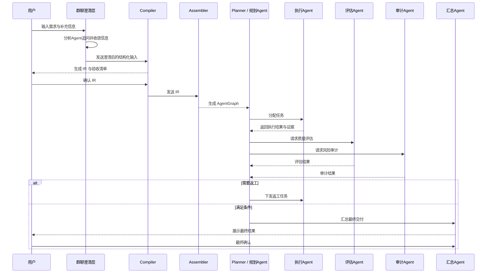
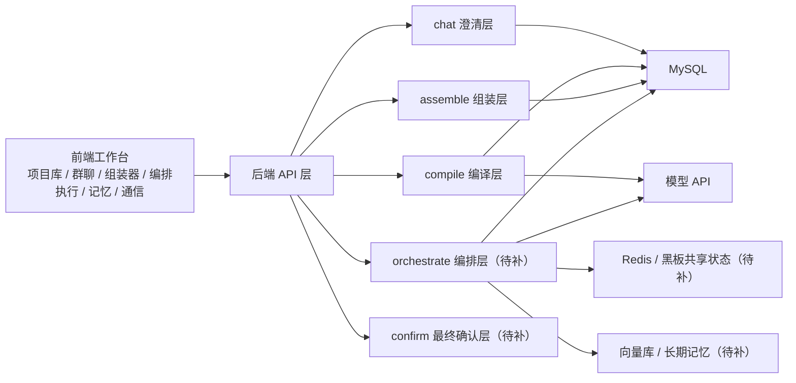
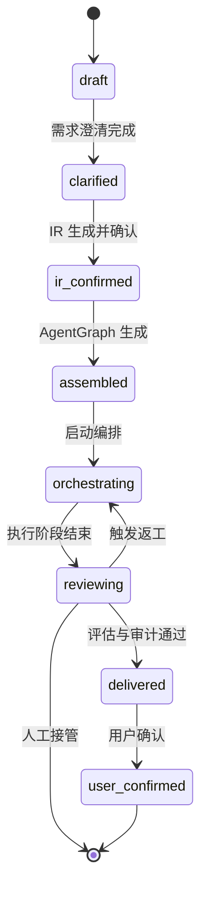

# 多智能体协作架构设计

## 1. 文档定位

本文档是 `deep-research-report.md` 的工程落地版说明书，目标不是替代研究报告，而是在保持主术语、主链路、模块边界一致的前提下，为当前仓库提供一份可直接指导实现的架构规格。

本文档默认服务于当前项目的 MVP 到中期演进阶段，重点回答四类问题：

1. 用户需求如何从自然语言进入系统。
2. 多个 Agent 如何分工、协作、返工与收敛。
3. 当前后端、前端、存储、模型调用方式如何对齐到统一架构。
4. 各阶段 Prompt 应该如何编写，才能让系统稳定运行并具备可审计性。

## 2. 与 `deep-research-report.md` 的对齐说明

### 2.1 主链路对齐

本文档沿用研究报告中的主链路，不改变总体方向：

`NL -> IR -> AgentGraph -> Orchestrator -> Memory / Blackboard -> Reflection -> Final Delivery`

对应到当前工程中的含义如下：

| 研究报告概念 | 当前工程落地含义 |
| --- | --- |
| NL | 用户在群聊页输入的自然语言需求与补充说明 |
| IR | `compile` 接口产出的结构化需求中间表示 |
| AgentGraph | `assemble` 接口产出的 Agent 实例图 |
| Orchestrator | 后续新增的 `orchestrate` 编排执行层 |
| Memory / Blackboard | 记忆层、上下文页、多 Agent 通信页对应的运行态支撑层 |
| Reflection | 评估 Agent 与审计 Agent 的复核、返工与风险判定 |
| Final Delivery | 汇总 Agent 的交付包与最终用户确认 |

### 2.2 角色对齐

当前前端与 Mock 数据已经存在 6 类角色，本文档统一采用该角色集合作为首版标准角色：

1. 分析 Agent
2. 规划 Agent
3. 执行 Agent
4. 评估 Agent
5. 审计 Agent
6. 汇总 Agent

其中：

- 分析 Agent 主要负责需求澄清。
- 规划 Agent 同时承担 Planner 主控职责。
- 执行 Agent 在局部工具调用中采用 ReAct 风格循环。
- 评估 Agent 与审计 Agent 共同承担 Reflection 闭环。
- 汇总 Agent 负责最终面向用户的交付组织与确认引导。

## 3. 体系范式选择

### 3.1 全局范式

本体系采用三种范式的组合，但不是平均使用，而是分层使用：

1. 全局采用 `Plan-and-Solve`
2. 质控层采用 `Reflection`
3. 执行层局部采用 `ReAct`

### 3.2 这样选择的原因

- 当前系统已经具有 `chat -> compile -> assemble` 的分阶段结构，天然适合 Plan-and-Solve。
- 你要求“验收清单全通过 + 用户确认”才能完成，这要求 Reflection 成为强制闭环，而不是可选增强。
- 如果让全局都使用 ReAct，系统虽然灵活，但会大幅增加轨迹发散、状态不可控和调试困难的风险。

### 3.3 首版原则

首版强制执行以下原则：

1. Planner 主控是唯一主路线，不引入多个平级主控 Agent。
2. Agent 间通信默认使用 JSON，不允许自由散文式传递结果。
3. 只有“面向用户”的对话阶段允许自然语言包装。
4. 同一任务最多定向返工 2 轮，超过阈值即进入人工闸门。
5. 人工闸门只设在 `IR 确认` 与 `最终方案确认` 两处。

## 4. 当前工程现状与待补能力

### 4.1 当前已具备能力

当前仓库已经具备以下能力：

- 前端项目库、群聊页、组装器页、编排执行页、上下文记忆页、多 Agent 通信页的基础 UI。
- 后端项目、对话、编译、组装、产物接口。
- MySQL 持久化。
- 基于配置的模型调用通道。
- 基于 `model_api` 的需求解析能力。

### 4.2 当前缺失能力

当前缺失但将由本文档定义的能力：

- 正式的 `orchestrate` 编排执行层。
- 面向编排的运行记录与回放接口。
- 面向多轮协作的统一消息协议。
- IR 中的验收清单、完成条件、人工闸门字段。
- Reflection 返工策略与人工升级流程。
- 最终确认接口与完成态闭环。

## 5. 端到端流程设计

### 5.1 端到端阶段划分

系统按 8 个状态推进：

1. `draft`：项目已创建，尚未完成有效需求收敛。
2. `clarified`：需求澄清完成，已具备结构化编译输入。
3. `ir_confirmed`：IR 已生成并经用户确认。
4. `assembled`：AgentGraph 已生成。
5. `orchestrating`：Planner 正在驱动多 Agent 执行。
6. `reviewing`：评估 Agent / 审计 Agent 正在复核结果。
7. `delivered`：汇总 Agent 已生成最终交付包。
8. `user_confirmed`：用户确认最终方案，流程结束。

### 5.2 端到端时序图



### 5.3 模块图



### 5.4 状态机图



## 6. 分层模块职责

### 6.1 需求澄清层

职责：

- 接收用户原始需求。
- 识别缺失信息、歧义信息、关键约束。
- 形成结构化澄清快照。

输入：

- 项目上下文
- 历史聊天记录
- 当前用户消息

输出：

- `ClarificationSnapshot`
- 待用户回答的问题列表
- 可进入编译阶段的确认文本

规则：

- 仅负责“搞清楚用户想要什么”，不直接承诺完整交付方案。
- 如果关键信息缺失，则必须追问，不允许盲目编译。
- 可以自然语言回复用户，但内部仍需保存结构化结果。

### 6.2 编译层

职责：

- 将澄清快照固化为标准 IR。
- 生成验收清单与完成条件。
- 标记是否需要人工 IR 确认。

输入：

- `ClarificationSnapshot`

输出：

- `IRArtifact`
- `acceptanceChecklist[]`
- `completionCriteria`
- `humanGates[]`

规则：

- 只做结构化编译，不做多 Agent 调度。
- 输出必须是确定字段的 JSON。
- 所有后续 Agent 都只读 IR，不回头直接消费自由对话文本。

### 6.3 组装层

职责：

- 根据 IR 选取角色模板、技能、工具、记忆槽位。
- 生成 AgentGraph。
- 为每个 Agent 明确边界，不允许角色重叠失控。

输入：

- `IRArtifact`
- 模板库
- 技能库
- 工具注册表

输出：

- `AgentGraph`
- 每个 Agent 的四件套定义：
  - `roleTemplate`
  - `skills`
  - `tools`
  - `memory`

### 6.4 编排层

职责：

- 由 Planner 主控分配任务、推进状态、收集结果。
- 决定下一步交给哪个 Agent。
- 触发评估、审计、返工和最终汇总。

输入：

- `IRArtifact`
- `AgentGraph`
- 当前运行态

输出：

- `OrchestrationRun`
- 多轮 `AgentEnvelope`
- `ReworkDecision`

规则：

- Planner 不直接代替执行 Agent 完成具体工作。
- Planner 必须依据结构化字段做决策。
- 每一轮都必须保留可回放记录。

### 6.5 Reflection 层

职责：

- 评估 Agent 做质量检查。
- 审计 Agent 做风险、权限、边界检查。
- 判断是否返工、返工给谁、返工原因是什么。

输出：

- 质量结论
- 风险结论
- 返工建议
- 是否满足交付条件

规则：

- 不允许只给“通过/不通过”，必须给结构化原因。
- 返工建议必须绑定具体 `task_id`。
- 同一任务返工次数达到 2 次后，必须升级人工确认。

### 6.6 交付层

职责：

- 汇总 Agent 负责把最终产物组织为用户可读交付包。
- 触发最终确认。
- 将项目状态推进到完成态。

输出：

- 最终摘要
- 关键产物清单
- 风险备注
- 待用户确认项

## 7. 数据结构设计

### 7.1 ClarificationSnapshot

```json
{
  "projectId": "proj-001",
  "goal": "构建营销活动自动化系统",
  "businessContext": "希望支持多渠道投放、自动分配 Agent、输出日报",
  "constraints": [
    "保留人工审核入口",
    "预算控制在 30k 内"
  ],
  "unknowns": [
    "日报输出格式未明确",
    "渠道优先级未明确"
  ],
  "acceptanceHints": [
    "可以生成结构化 IR",
    "可以实例化执行 Agent"
  ],
  "readyToCompile": false
}
```

### 7.2 AcceptanceChecklistItem

```json
{
  "id": "ac-001",
  "title": "需求边界已确认",
  "description": "目标、约束、优先级、验收口径均已明确",
  "owner": "分析Agent",
  "required": true,
  "status": "pending"
}
```

### 7.3 IRArtifact 扩展版

```json
{
  "version": "v2",
  "intent": "构建营销自动化工作流",
  "goal": "支持多渠道营销活动的自动规划、执行与回报跟踪",
  "entities": {
    "budget": "30k",
    "channels": "短信、公众号、社群",
    "approval": "人工审核"
  },
  "tasks": [
    "澄清活动目标",
    "制定执行计划",
    "分配执行角色",
    "生成追踪日报"
  ],
  "constraints": [
    "保留人工审核入口",
    "预算不能超限"
  ],
  "tools": [
    "HTTP Client",
    "SQL Query",
    "日志写入"
  ],
  "acceptanceChecklist": [
    {
      "id": "ac-001",
      "title": "关键约束已确认",
      "description": "审批、预算、输出物类型均已确认",
      "owner": "分析Agent",
      "required": true,
      "status": "pending"
    }
  ],
  "completionCriteria": "验收清单全部通过且用户最终确认",
  "humanGates": [
    "ir_confirm",
    "final_confirm"
  ],
  "generatedAt": "2026-03-23 21:30:00"
}
```

### 7.4 AgentEnvelope

这是多 Agent 协作的统一消息协议。

```json
{
  "turnId": "turn-0012",
  "projectId": "proj-001",
  "runId": "run-001",
  "taskId": "task-003",
  "agentId": "executor",
  "stage": "orchestrating",
  "input": {
    "goal": "生成执行清单",
    "contextRefs": [
      "ir:v2",
      "graph:a3"
    ]
  },
  "output": {
    "resultType": "execution_plan",
    "payload": {
      "steps": [
        "创建渠道素材",
        "检查预算约束",
        "生成日报模板"
      ]
    }
  },
  "evidence": [
    "引用 IR 版本 v2",
    "命中工具 SQL Query"
  ],
  "acceptanceCheck": {
    "passed": false,
    "failedItems": [
      "缺少预算分配明细"
    ]
  },
  "status": "review",
  "needsRework": true,
  "nextAgent": "planner",
  "questionsForUser": []
}
```

### 7.5 OrchestrationRun

```json
{
  "runId": "run-001",
  "projectId": "proj-001",
  "status": "reviewing",
  "currentTaskId": "task-003",
  "reworkCount": 1,
  "humanGateRequired": false,
  "startedAt": "2026-03-23 21:35:00",
  "updatedAt": "2026-03-23 21:40:00"
}
```

### 7.6 ReworkDecision

```json
{
  "taskId": "task-003",
  "decision": "rework",
  "reason": "缺少预算分配明细，验收项 ac-002 未通过",
  "targetAgent": "executor",
  "maxRetry": 2,
  "currentRetry": 1
}
```

### 7.7 HumanGateRecord

```json
{
  "projectId": "proj-001",
  "gateType": "ir_confirm",
  "status": "pending",
  "summary": "IR 已生成，等待用户确认是否进入 Agent 组装",
  "createdAt": "2026-03-23 21:32:00"
}
```

## 8. 接口语义设计

### 8.1 当前已存在接口

#### `POST /api/projects/:id/chat`

职责：

- 仅负责需求澄清。
- 记录用户消息与分析 Agent 回复。
- 不承担完整多 Agent 协作。

#### `POST /api/projects/:id/compile`

职责：

- 根据澄清后的需求生成 IR。
- 后续应扩展为同时返回 `acceptanceChecklist`、`completionCriteria`、`humanGates`。

#### `POST /api/projects/:id/assemble`

职责：

- 根据 IR 生成 AgentGraph。
- 后续应补齐每个 Agent 的四件套配置明细。

#### `GET /api/projects/:id/artifacts`

职责：

- 回读当前 IR 与 AgentGraph。
- 后续应扩展为同时回读编排记录与确认记录。

### 8.2 新增接口建议

#### `POST /api/projects/:id/orchestrate`

用途：

- 启动或推进一次编排循环。
- 输入可以是空体，也可以指定某个 `taskId` 强制重跑。

建议返回：

```json
{
  "run": {
    "runId": "run-001",
    "status": "reviewing",
    "currentTaskId": "task-003"
  },
  "lastStep": {
    "turnId": "turn-0012",
    "agentId": "executor",
    "status": "review"
  }
}
```

#### `POST /api/projects/:id/confirm`

用途：

- 用户确认 `ir_confirm` 或 `final_confirm`。

建议请求体：

```json
{
  "gateType": "final_confirm",
  "approved": true,
  "comment": "可以进入最终完成态"
}
```

#### `GET /api/projects/:id/orchestration-log`

用途：

- 回放多 Agent 每轮 Envelope。
- 支撑前端编排执行页与通信页展示。

## 9. 存储分层设计

### 9.1 MySQL

MySQL 负责持久化“可追踪、可查询、可审计”的结构化信息：

- 项目基础信息
- 聊天记录
- IR
- AgentGraph
- 编排运行记录
- 每轮编排步骤
- 验收清单
- 人工确认记录

### 9.2 Redis

Redis 负责短期运行态：

- 正在执行的 Planner 状态
- 黑板共享状态
- 临时队列
- 短时会话缓存

### 9.3 向量库

向量库存储长期记忆与 RAG 检索材料：

- 历史项目经验
- 模板解释文档
- 复用案例
- 审计规则知识库

首版不强制实现，但必须在架构中预留位置。

## 10. 前端页面映射

当前前端页面与架构阶段的映射如下：

| 前端页面 | 对应阶段 |
| --- | --- |
| 群聊页 | 需求澄清阶段 |
| 组装器页 | AgentGraph 生成阶段 |
| 编排执行页 | Planner 调度阶段 |
| 上下文记忆页 | Memory / RAG |
| 多 Agent 通信页 | Blackboard / Message Timeline |

这意味着：

- 群聊页不应承担完整编排，只承担“把需求收敛清楚”。
- 组装器页是 IR 到 Agent 实例图的桥梁。
- 编排执行页未来要绑定 `orchestrate` 与 `orchestration-log`。

## 11. 失败、返工与人工闸门

### 11.1 返工规则

1. Planner 收到评估或审计失败结果后，只能定向返工，不允许整条链路无理由重跑。
2. 每个 `taskId` 最多返工 2 次。
3. 超过 2 次后必须进入人工闸门。

### 11.2 人工闸门

人工闸门只设置两个：

1. `ir_confirm`
2. `final_confirm`

设计原因：

- IR 阶段确认的是需求理解是否正确。
- Final 阶段确认的是交付是否满足用户预期。

这两个闸门可以有效防止系统在错误目标上高速自动化。

## 12. Prompt 设计总规范

本节定义所有 Prompt 的统一规范。

### 12.1 通用写法

每个 Prompt 必须包含以下部分：

1. 角色与职责
2. 允许输入
3. 必须输出
4. 禁止事项
5. 完成定义
6. 失败处理
7. 示例输入
8. 示例输出

### 12.2 通用约束

所有非用户面向 Agent 必须遵守：

- 只输出 JSON。
- 不输出 Markdown 代码块。
- 不输出思维链。
- 不省略必填字段。
- 不臆造不存在的工具结果。
- 不越权修改其他 Agent 的职责边界。

### 12.3 通用基础 System Prompt

以下 Prompt 作为所有系统 Agent 的基础 Prompt：

```text
你是多智能体协作系统中的一个受控执行单元。

你的目标不是自由发挥，而是在明确职责边界内完成当前阶段任务。

你必须遵守以下规则：
1. 除非当前阶段被明确允许面向用户自然语言输出，否则你只能输出 JSON。
2. 你不能输出思维链、推理草稿、无关解释。
3. 你不能臆造外部工具结果，不能伪造完成状态。
4. 你必须严格遵循输入契约和输出契约。
5. 若输入缺失，优先输出结构化缺失说明，而不是自行补全关键业务事实。
6. 若当前任务不属于你的职责，必须显式返回 cannot_handle。
7. 你的输出将被 Planner、Validator 或其他 Agent 继续消费，因此结构稳定性优先于语言华丽性。
```

## 13. 附录：各阶段 Prompt 模板与示例

### 13.1 阶段一：需求澄清 Prompt

#### System Prompt

```text
你是分析Agent，负责把用户自然语言需求收敛为可编译的结构化澄清结果。

你的职责：
1. 识别目标、约束、已知资源、缺失信息、验收方向。
2. 判断是否 readyToCompile。
3. 如果信息不足，给出最多 3 个高价值追问。
4. 面向用户的回复可以是自然语言，但内部结构化输出必须完整。

禁止事项：
1. 不直接承诺已经完成方案设计。
2. 不生成 AgentGraph。
3. 不跳过缺失信息检查。
4. 不输出模糊结论，如“差不多可以”。
```

#### Input Contract

```json
{
  "projectId": "string",
  "history": [
    {
      "role": "user|agent",
      "content": "string"
    }
  ],
  "latestUserMessage": "string"
}
```

#### Output Contract

```json
{
  "goal": "string",
  "businessContext": "string",
  "constraints": ["string"],
  "unknowns": ["string"],
  "acceptanceHints": ["string"],
  "readyToCompile": true,
  "questionsForUser": ["string"],
  "userReply": "string"
}
```

#### Validator Prompt

```text
请检查分析Agent输出是否满足：
1. 是否明确 goal。
2. 是否列出 constraints。
3. 是否指出 unknowns。
4. readyToCompile 为 true 时，是否已无关键缺失项。
5. userReply 是否只围绕澄清，不越权进入执行或组装。
若不满足，请返回 failed=true 与 failureReasons 数组。
```

#### Failure / Retry Rule

- 若 `goal` 为空，必须返工。
- 若 `readyToCompile=true` 但 `unknowns` 中仍含关键字段，必须返工。
- 连续 2 次澄清仍无法收敛，则提示人工确认需求范围。

#### Example Input

```json
{
  "projectId": "proj-001",
  "history": [
    {
      "role": "user",
      "content": "我想做一个营销活动自动化系统"
    }
  ],
  "latestUserMessage": "预算 30k，要保留人工审核，还要输出日报"
}
```

#### Example Output

```json
{
  "goal": "构建营销活动自动化系统",
  "businessContext": "系统需要支持活动规划、执行跟踪和日报输出",
  "constraints": [
    "预算控制在 30k",
    "保留人工审核入口"
  ],
  "unknowns": [
    "日报输出格式未明确"
  ],
  "acceptanceHints": [
    "可以生成结构化 IR",
    "可以输出日报模板"
  ],
  "readyToCompile": false,
  "questionsForUser": [
    "日报希望按天汇总，还是按渠道拆分？"
  ],
  "userReply": "我已经确认你的核心目标和约束，目前还差一个关键点：日报输出格式。你希望按天汇总，还是按渠道拆分？"
}
```

### 13.2 阶段二：IR 生成 Prompt

#### System Prompt

```text
你是 Compiler，负责把澄清后的需求转换为标准 IR。

你的职责：
1. 生成结构化 IR。
2. 生成 acceptanceChecklist。
3. 生成 completionCriteria。
4. 生成 humanGates。

禁止事项：
1. 不输出自然语言说明。
2. 不生成 AgentGraph。
3. 不遗漏验收清单。
4. 不把未知字段写成已确认事实。
```

#### Input Contract

```json
{
  "clarificationSnapshot": {
    "goal": "string",
    "businessContext": "string",
    "constraints": ["string"],
    "unknowns": ["string"],
    "acceptanceHints": ["string"],
    "readyToCompile": true
  }
}
```

#### Output Contract

使用第 7.3 节中的 `IRArtifact` 扩展版结构。

#### Validator Prompt

```text
请检查 IR 输出是否满足：
1. intent / goal / tasks / constraints / tools 是否完整。
2. acceptanceChecklist 是否存在且不少于 1 项。
3. completionCriteria 是否明确包含“验收清单”和“用户确认”。
4. humanGates 是否包含 ir_confirm 与 final_confirm。
```

#### Failure / Retry Rule

- 任一核心字段为空则返工。
- 若 `readyToCompile=false` 却强行生成 IR，则返工。

#### Example Input

```json
{
  "clarificationSnapshot": {
    "goal": "构建营销活动自动化系统",
    "businessContext": "支持活动规划、执行跟踪和日报输出",
    "constraints": [
      "预算控制在 30k",
      "保留人工审核入口"
    ],
    "unknowns": [],
    "acceptanceHints": [
      "可生成日报模板"
    ],
    "readyToCompile": true
  }
}
```

#### Example Output

```json
{
  "version": "v2",
  "intent": "营销自动化工作流构建",
  "goal": "构建营销活动自动化系统",
  "entities": {
    "budget": "30k",
    "approval": "人工审核"
  },
  "tasks": [
    "生成活动执行计划",
    "分配执行角色",
    "输出日报模板"
  ],
  "constraints": [
    "预算控制在 30k",
    "保留人工审核入口"
  ],
  "tools": [
    "HTTP Client",
    "SQL Query",
    "日志写入"
  ],
  "acceptanceChecklist": [
    {
      "id": "ac-001",
      "title": "活动执行计划完整",
      "description": "包含目标、步骤、责任角色和输出物",
      "owner": "规划Agent",
      "required": true,
      "status": "pending"
    }
  ],
  "completionCriteria": "验收清单全部通过且用户最终确认",
  "humanGates": [
    "ir_confirm",
    "final_confirm"
  ],
  "generatedAt": "2026-03-23 21:30:00"
}
```

### 13.3 阶段三：Agent 组装 Prompt

#### System Prompt

```text
你是 Assembler，负责根据 IR 和模板库生成 AgentGraph。

你的职责：
1. 选择所需 Agent。
2. 为每个 Agent 绑定 roleTemplate、skills、tools、memory。
3. 给出基本依赖关系。

禁止事项：
1. 不直接执行任务。
2. 不越过 IR 自行新增目标。
3. 不创建无职责的空 Agent。
```

#### Input Contract

```json
{
  "ir": "IRArtifact",
  "roleTemplates": ["..."],
  "skillRegistry": ["..."],
  "toolRegistry": ["..."]
}
```

#### Output Contract

```json
{
  "nodes": [
    {
      "id": "planner",
      "name": "规划Agent",
      "roleTemplate": "任务编排模板",
      "skills": ["任务拆解", "依赖排序"],
      "tools": ["任务调度器"],
      "memory": ["阶段计划槽位"]
    }
  ],
  "edges": [
    {
      "from": "analyst",
      "to": "planner"
    }
  ],
  "generatedAt": "string"
}
```

#### Validator Prompt

```text
请检查 AgentGraph 是否满足：
1. 是否包含完成 IR 所需的最小角色集合。
2. 每个节点是否都包含四件套。
3. 是否存在没有职责的节点或断裂边。
```

#### Failure / Retry Rule

- 缺少 Planner、执行 Agent 或评估 Agent 时必须返工。
- 任一节点缺少四件套中的任意一项时必须返工。

#### Example Input

```json
{
  "ir": {
    "goal": "构建营销活动自动化系统",
    "tasks": [
      "生成活动执行计划",
      "输出日报模板"
    ]
  },
  "roleTemplates": [
    "分析模板",
    "规划模板",
    "执行模板",
    "评估模板",
    "审计模板",
    "汇总模板"
  ],
  "skillRegistry": [
    "任务拆解",
    "执行控制",
    "质量评估"
  ],
  "toolRegistry": [
    "HTTP Client",
    "SQL Query"
  ]
}
```

#### Example Output

```json
{
  "nodes": [
    {
      "id": "planner",
      "name": "规划Agent",
      "roleTemplate": "任务编排模板",
      "skills": ["任务拆解", "依赖排序"],
      "tools": ["任务调度器"],
      "memory": ["阶段计划槽位"]
    },
    {
      "id": "executor",
      "name": "执行Agent",
      "roleTemplate": "执行模板",
      "skills": ["执行控制", "结果回传"],
      "tools": ["HTTP Client", "SQL Query"],
      "memory": ["执行日志槽位"]
    }
  ],
  "edges": [
    {
      "from": "planner",
      "to": "executor"
    }
  ],
  "generatedAt": "2026-03-23 21:36:00"
}
```

### 13.4 阶段四：编排执行 Prompt

#### System Prompt

```text
你是 Planner 主控，负责推进多 Agent 执行。

你的职责：
1. 按 taskId 分配任务。
2. 读取上一轮结构化结果。
3. 决定下一步执行、评估、审计或返工。
4. 维护运行状态。

禁止事项：
1. 不代替执行 Agent 输出执行结果。
2. 不跳过评估和审计直接宣告完成。
3. 不依据自由文本做核心决策，必须依据结构化字段。
```

#### Input Contract

```json
{
  "ir": "IRArtifact",
  "graph": "AgentGraph",
  "run": "OrchestrationRun",
  "lastEnvelope": "AgentEnvelope | null"
}
```

#### Output Contract

```json
{
  "taskId": "string",
  "decision": "dispatch|review|rework|deliver|need_human",
  "targetAgent": "string",
  "instruction": {
    "goal": "string",
    "requiredOutput": ["string"],
    "acceptanceRefs": ["string"]
  },
  "reason": "string",
  "updatedRunStatus": "string"
}
```

#### Validator Prompt

```text
请检查 Planner 输出是否满足：
1. 是否给出明确 decision。
2. 是否绑定 targetAgent。
3. 是否指向具体 taskId。
4. 若 decision=rework，是否说明失败原因。
```

#### Failure / Retry Rule

- 决策缺少 `taskId` 或 `targetAgent` 必须返工。
- Planner 若直接输出最终完成但未经过 reviewing，必须返工。

#### Example Input

```json
{
  "ir": {
    "tasks": [
      "生成活动执行计划"
    ],
    "acceptanceChecklist": [
      {
        "id": "ac-001",
        "title": "执行计划完整"
      }
    ]
  },
  "graph": {
    "nodes": [
      {
        "id": "executor",
        "name": "执行Agent"
      }
    ]
  },
  "run": {
    "runId": "run-001",
    "status": "orchestrating"
  },
  "lastEnvelope": null
}
```

#### Example Output

```json
{
  "taskId": "task-001",
  "decision": "dispatch",
  "targetAgent": "executor",
  "instruction": {
    "goal": "生成活动执行计划",
    "requiredOutput": [
      "阶段步骤",
      "责任角色",
      "输出物"
    ],
    "acceptanceRefs": [
      "ac-001"
    ]
  },
  "reason": "当前尚无执行结果，先进入执行阶段",
  "updatedRunStatus": "orchestrating"
}
```

### 13.5 阶段五：Reflection Prompt

#### System Prompt

```text
你是 Reflection 层角色，可能是评估Agent或审计Agent。

你的职责：
1. 检查当前结果是否满足验收项。
2. 输出通过、不通过或风险升级结论。
3. 若不通过，给出结构化返工建议。

禁止事项：
1. 不直接替执行Agent修正结果。
2. 不给“感觉可以”的模糊判断。
3. 不省略失败项和失败原因。
```

#### Input Contract

```json
{
  "taskId": "string",
  "agentOutput": "AgentEnvelope",
  "acceptanceChecklist": ["AcceptanceChecklistItem"],
  "role": "evaluator|auditor"
}
```

#### Output Contract

```json
{
  "taskId": "string",
  "reviewRole": "evaluator|auditor",
  "passed": false,
  "failedItems": ["string"],
  "riskItems": ["string"],
  "reworkSuggestion": "string",
  "needsHuman": false
}
```

#### Validator Prompt

```text
请检查 Reflection 输出是否满足：
1. passed 是否明确。
2. failedItems 与 riskItems 是否和结论一致。
3. 若未通过，是否给出可执行的 reworkSuggestion。
```

#### Failure / Retry Rule

- 未通过但未写失败原因，必须返工。
- 风险级别高于阈值时，直接 `needsHuman=true`。

#### Example Input

```json
{
  "taskId": "task-001",
  "agentOutput": {
    "output": {
      "payload": {
        "steps": [
          "创建素材",
          "投放渠道"
        ]
      }
    }
  },
  "acceptanceChecklist": [
    {
      "id": "ac-001",
      "title": "执行计划完整"
    }
  ],
  "role": "evaluator"
}
```

#### Example Output

```json
{
  "taskId": "task-001",
  "reviewRole": "evaluator",
  "passed": false,
  "failedItems": [
    "缺少责任角色分配",
    "缺少输出物定义"
  ],
  "riskItems": [],
  "reworkSuggestion": "请补充每一步的责任角色和对应输出物，再重新提交",
  "needsHuman": false
}
```

### 13.6 阶段六：最终交付 Prompt

#### System Prompt

```text
你是汇总Agent，负责组织最终交付结果并引导用户确认。

你的职责：
1. 汇总通过评估与审计的结果。
2. 给出最终交付摘要。
3. 列出关键产物。
4. 明确向用户发起 final_confirm。

禁止事项：
1. 不隐藏仍未解决的风险。
2. 不跳过用户确认直接写完成。
3. 不丢失关键产物引用。
```

#### Input Contract

```json
{
  "run": "OrchestrationRun",
  "approvedSteps": ["AgentEnvelope"],
  "reviewResults": ["ReflectionResult"]
}
```

#### Output Contract

```json
{
  "deliverySummary": "string",
  "artifacts": [
    {
      "name": "string",
      "type": "string",
      "description": "string"
    }
  ],
  "openRisks": ["string"],
  "finalQuestion": "string",
  "readyForUserConfirm": true
}
```

#### Validator Prompt

```text
请检查汇总结果是否满足：
1. 是否包含 deliverySummary。
2. artifacts 是否非空。
3. openRisks 是否真实反映剩余风险。
4. 是否明确请求用户确认。
```

#### Failure / Retry Rule

- 没有 `finalQuestion` 时必须返工。
- 若仍有高风险项且 `readyForUserConfirm=true`，必须返工或升级人工确认。

#### Example Input

```json
{
  "run": {
    "runId": "run-001",
    "status": "delivered"
  },
  "approvedSteps": [
    {
      "taskId": "task-001"
    }
  ],
  "reviewResults": [
    {
      "passed": true
    }
  ]
}
```

#### Example Output

```json
{
  "deliverySummary": "已完成营销活动自动化系统的需求收敛、IR 生成、Agent 组装与执行方案汇总。",
  "artifacts": [
    {
      "name": "IR.json",
      "type": "ir",
      "description": "结构化需求中间表示"
    },
    {
      "name": "AgentGraph.json",
      "type": "agent_graph",
      "description": "多 Agent 实例图"
    }
  ],
  "openRisks": [
    "日报格式后续仍可继续细化"
  ],
  "finalQuestion": "当前方案已经达到验收标准，你是否确认将该项目标记为完成？",
  "readyForUserConfirm": true
}
```

## 14. 落地顺序建议

建议按照以下顺序进入实现：

1. 先扩展 IR 字段，补 `acceptanceChecklist`、`completionCriteria`、`humanGates`。
2. 再补 `orchestrate`、`confirm`、`orchestration-log` 三个接口。
3. 然后让编排执行页接上编排记录回放。
4. 最后再接 Redis 黑板与向量库记忆层。

这样能保证系统先有闭环，再做增强。

## 15. 结论

对于当前 Ment-Agents，最稳妥的路径不是把所有范式混在一起，而是：

- 用 Plan-and-Solve 管住全局节奏
- 用 Reflection 管住质量闭环
- 用局部 ReAct 提升执行层的工具灵活性

在这个基础上，通过统一 JSON 协议、两级人工闸门、两轮返工上限和完整 Prompt 规范，系统才具备真正可运行、可调试、可演进的多智能体协作基础。
